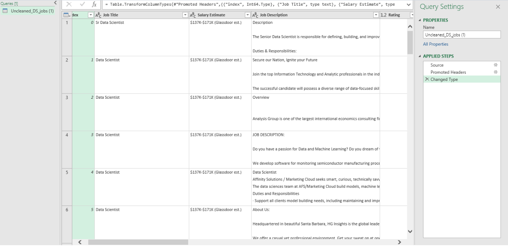
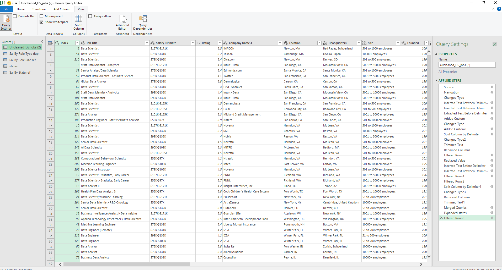
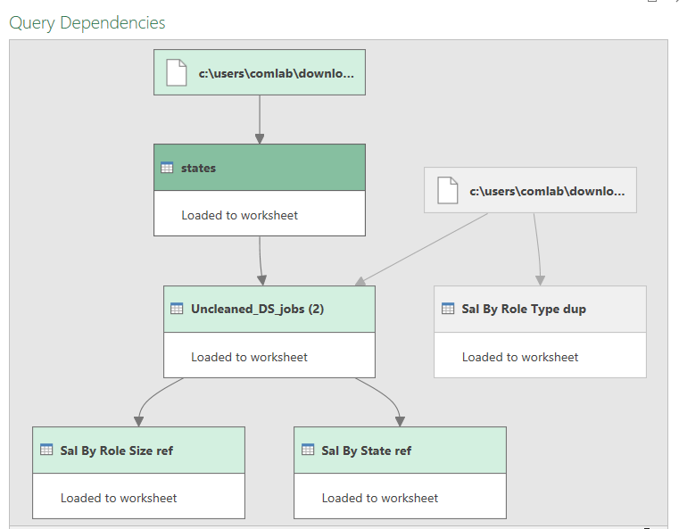

# [Midterm Lab Task 2]
This portfolio demonstrates the process of data cleaning and preparation using Power Query. The dataset consists of multiple related tables, where cleaning techniques are applied to improve data quality and consistency before analysis.

## Step-by-Step Process
### Step 1: Download and Load Data  
1. Download the dataset (Uncleaned_DS_jobs.csv)  
2. Open Excel  
3. Go to Data → New Query → Open File → Text/CSV  
4. Click Load and then Edit using Power Query Editor  

### Step 2: Duplicate Raw Data  
1. Right-click the dataset in the Queries pane  
2. Select Duplicate  

### Step 3: Clean Salary Data  
1. Select the Salary Estimate column  
2. Go to Transform Menu → Extract → Text Before Delimiter  
3. Type "(" and click OK  
4. Create two new columns: Min Salary and Max Salary  
   - Select Salary Estimate column → Add Column Menu → Column from Examples → From Selections  
   - Type the first min salary value and press Enter (all rows will auto-fill)  
   - Rename the column to "Min Sal"  
   - Repeat the process for Max Salary  

### Step 4: Add Role Type Column  
1. Go to Add Column Menu → Custom Column  
2. Rename the column to "Role Type"  
3. Use this logic:  
   - If Job Title contains "Data Scientist" → Assign "Data Scientist"  
   - If Job Title contains "Data Analyst" → Assign "Data Analyst"  
   - If Job Title contains "Data Engineer" → Assign "Data Engineer"  
   - If Job Title contains "Machine Learning" → Assign "Machine Learning Engineer"  
   - Otherwise, assign "Other"  
4. Change the column type to Text  

### Step 5: Split Location Column  
1. Select the Location column  
2. Add a Custom Column with corrections:  
   - If Location = "New Jersey" → Assign ", NJ"  
   - If Location = "Remote" or "United States" → Assign ", Other"  
   - If Location = "Texas" → Assign ", TX"  
   - If Location = "California" → Assign ", CA"  
3. Click OK, then select the new column  
4. Go to Transform → Split Column → By Delimiter (comma ",")  
5. Click OK  
6. Rename the second split column to "State Abbreviations"  
7. Check and replace incorrect values (e.g., "Anne Rundell" → "MA")  

### Step 6: Split Size Column  
1. Create two new columns: MinCompanySize and MaxCompanySize  
2. Use the same method as Salary Estimate to split values  

### Step 7: Handle Negative Values  
1. Filter out -1s from the Competitors column  
2. Filter out 0s from the Revenues column  
3. Remove -1s from the Industry column  

### Step 8: Clean Company Names  
1. Remove any extra characters or ratings after company names  

### Step 9: Copy Cleaning Steps as Proof  
1. Go to Home Menu → Click Advanced Editor  
2. Copy and save the code in your portfolio  

### Step 10: Reshape and Group Data  
#### Group by Role Type  
1. Duplicate the raw data → Rename it as "Sal By Role Type dup"  
2. Select only Role Type, Min Salary, and Max Salary columns  
3. Change Min and Max Salary type to currency  
4. Multiply values by 1000 (Numbers Column → Standard → Multiply → Type 1000)  
5. Group rows by Role Type and get the average for Min and Max Salary  

#### Group by Company Size  
1. Create a reference of raw data → Rename it as "Sal By Role Size ref"  
2. Select only Size, Min Salary, and Max Salary columns  
3. Change Min and Max Salary type to currency  
4. Multiply values by 1000  
5. Group rows by Size and get the average for Min and Max Salary  

### Step 11: Merge State Mapping  
1. Click Unclean DS Jobs  
2. Right-click in the Queries pane → New Query → Open Workbook State Mapping  
3. Select the columns and click OK  
4. Select Uncleaned DS Jobs query  
5. Choose the State Abbreviation column in both queries  
6. Click Merge → Click OK  
7. Rename the merged column as "State Full Name"  
8. Remove nulls and blanks  

### Step 12: Group by State  
1. Create a reference of raw data → Rename it as "Sal By State ref"  
2. Select only State Full Name, Min Salary, and Max Salary columns  
3. Change Min and Max Salary type to currency  
4. Multiply values by 1000  
5. Group rows by State Full Name and get the average for Min and Max Salary  

### Step 13: View Query Dependencies  
1. Go to View Menu → Click Dependencies  
2. Check if all queries are correctly linked  

## Here are the screenshots showcasing the table transformation process
### Here's the screenshot of my output before I started data cleaning (see screenshot)

### Here's the code proof for my cleaning of data

let
    Source = Excel.Workbook(File.Contents("C:\Users\COMLAB\Downloads\Book1.xlsx"), null, true),
    Uncleaned_DS_jobs_Table = Source{[Item="Uncleaned_DS_jobs",Kind="Table"]}[Data],
    #"Changed Type" = Table.TransformColumnTypes(Uncleaned_DS_jobs_Table,{{"index", Int64.Type}, {"Job Title", type text}, {"Salary Estimate", type text}, {"Job Description", type text}, {"Rating", type number}, {"Company Name", type text}, {"Location", type text}, {"Headquarters", type any}, {"Size", type any}, {"Founded", Int64.Type}, {"Type of ownership", type any}, {"Industry", type any}, {"Sector", type any}, {"Revenue", type any}, {"Competitors", type any}}),
    #"Inserted Text Between Delimiters" = Table.AddColumn(#"Changed Type", "Min Salary", each Text.BetweenDelimiters([Salary Estimate], "$", "K"), type text),
    #"Inserted Text Between Delimiters1" = Table.AddColumn(#"Inserted Text Between Delimiters", "Max Salary", each Text.BetweenDelimiters([Salary Estimate], "$", "K", 1, 0), type text),
    #"Extracted Text Before Delimiter" = Table.TransformColumns(#"Inserted Text Between Delimiters1", {{"Salary Estimate", each Text.BeforeDelimiter(_, "("), type text}}),
    #"Added Custom" = Table.AddColumn(#"Extracted Text Before Delimiter", "Role Type", each if Text.Contains([Job Title], "Data Scientist") then
"Data Scientist"
else if Text.Contains([Job Title], "Data Analyst") then
"Data Analyst"
else if Text.Contains([Job Title], "Data Engineer") then
"Data Engineer"

else if Text.Contains([Job Title], "Machine Learning") then
"Machine Learning Engineer"
else
"other"),
    #"Changed Type1" = Table.TransformColumnTypes(#"Added Custom",{{"Role Type", type text}}),
    #"Added Custom1" = Table.AddColumn(#"Changed Type1", "Custom", each if [Location]= "New Jersey" then ", NJ"
else if [Location] = "Remote" then ", other"
else if [Location]= "United States" then ", other"
else if [Location]= "Texas" then ", TX"
else if [Location]= "Patuxent" then ", MA"
else if [Location]= "California" then ", CA"
else if [Location]= "Utah" then ", UT"
else [Location]),
    #"Split Column by Delimiter" = Table.SplitColumn(#"Added Custom1", "Custom", Splitter.SplitTextByDelimiter(",", QuoteStyle.Csv), {"Custom.1", "Custom.2"}),
    #"Changed Type2" = Table.TransformColumnTypes(#"Split Column by Delimiter",{{"Custom.1", type text}, {"Custom.2", type text}}),
    #"Trimmed Text" = Table.TransformColumns(#"Changed Type2",{{"Custom.2", Text.Trim, type text}}),
    #"Renamed Columns" = Table.RenameColumns(#"Trimmed Text",{{"Custom.2", "State Abbreviation"}, {"Custom.1", "Location Correction"}}),
    #"Filtered Rows" = Table.SelectRows(#"Renamed Columns", each ([State Abbreviation] <> "Anne Arundel")),
    #"Replaced Value" = Table.ReplaceValue(#"Filtered Rows","Anne Rundell","MA",Replacer.ReplaceText,{"State Abbreviation"}),
    #"Inserted Text Before Delimiter" = Table.AddColumn(#"Replaced Value", "Minimum Company Size", each Text.BeforeDelimiter([Size], " "), type text),
    #"Inserted Text Between Delimiters2" = Table.AddColumn(#"Inserted Text Before Delimiter", "Maximum Company Size", each Text.BetweenDelimiters([Size], " ", " ", 1, 0), type text),
    #"Filtered Rows1" = Table.SelectRows(#"Inserted Text Between Delimiters2", each ([Competitors] <> -1)),
    #"Filtered Rows2" = Table.SelectRows(#"Filtered Rows1", each ([Revenue] <> "Unknown / Non-Applicable") and ([Industry] <> -1)),
    #"Split Column by Delimiter1" = Table.SplitColumn(#"Filtered Rows2", "Company Name", Splitter.SplitTextByDelimiter("#(lf)", QuoteStyle.Csv), {"Company Name.1", "Company Name.2"}),
    #"Changed Type3" = Table.TransformColumnTypes(#"Split Column by Delimiter1",{{"Company Name.1", type text}, {"Company Name.2", type number}}),
    #"Removed Columns" = Table.RemoveColumns(#"Changed Type3",{"Company Name.2", "Job Description"}),
    #"Trimmed Text1" = Table.TransformColumns(#"Removed Columns",{{"State Abbreviation", Text.Trim, type text}}),
    #"Merged Queries" = Table.NestedJoin(#"Trimmed Text1",{"State Abbreviation"},states,{"2-letter USPS"},"states",JoinKind.LeftOuter),
    #"Expanded states" = Table.ExpandTableColumn(#"Merged Queries", "states", {"Full Name", "2-letter USPS"}, {"states.Full Name", "states.2-letter USPS"}),
    #"Filtered Rows3" = Table.SelectRows(#"Expanded states", each ([#"states.2-letter USPS"] <> null))
in
    #"Filtered Rows3"

### Here's the screenshot of my output after I started data cleaning (see screenshot)

### Here's the screenshot of the Query Dependencies

   
