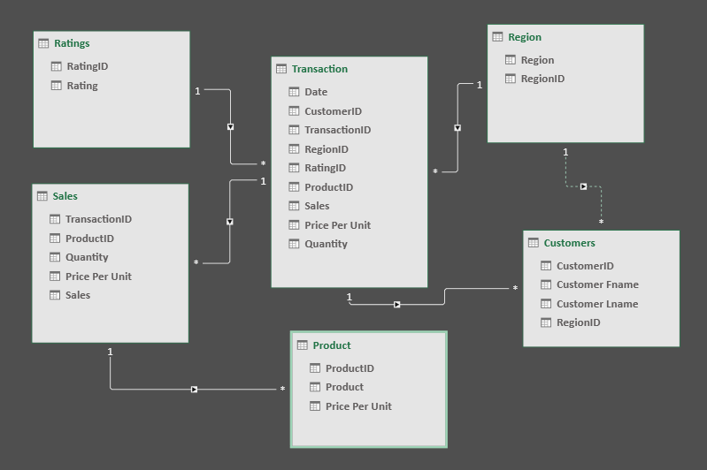

# Midterm Lab Task 1 - Data Cleaning and Preparation using Excel
For this task we are given a Flat data from Excel (See rawfile) and we are Task to perform Data CLeaning and Preparation

## STEP 1 Screenshot of raw data

## STEP 2 Normalization

## STEP 3 Cleaneddata

## STEP 4 Data Model

